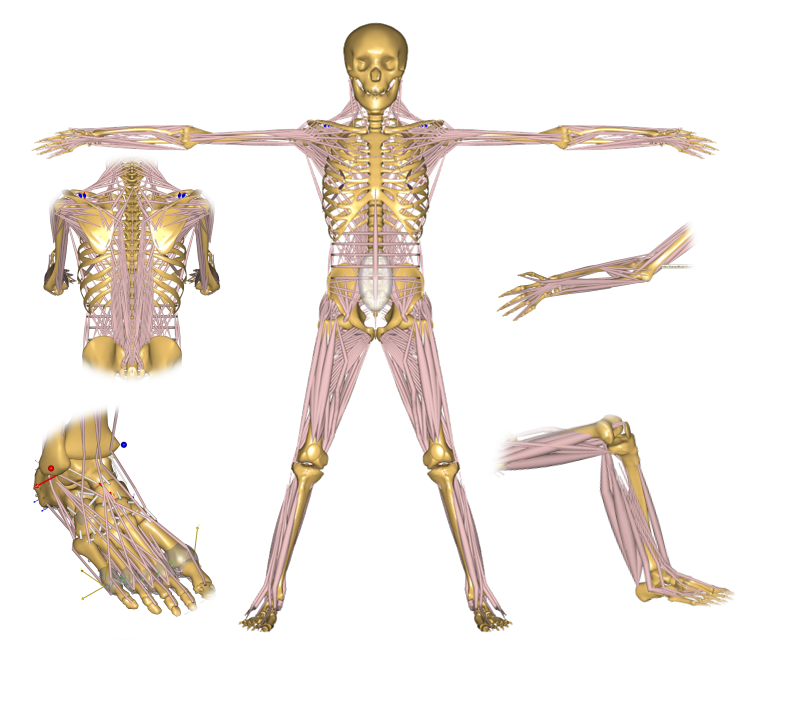

# Welcome to the AMMR documentation!

The AnyBody Model Repository (AMMR), is an open library of
musculoskeletal models and examples ready to be used with the [AnyBody Modeling
System][anybody modeling system].

```{rst-class} float-right
```

:::{seealso}
{{ WHAT_IS_NEW }}
:::

:::{figure-md} 
:align: center
:alt: The AnyBody Model Repository
:figwidth: 85 %
:width: 70 %



The AnyBody Model Repository is a *unique* open collection of human body parts.
:::

The AnyBody Managed Model Repository consists of two parts:

- {ref}`Body Models <the-body-model>`: The human body models which can be
  customized and scaled to build a specific musculoskeletal model;
- {ref}`Application examples <examples-index>`: in which the body models are
  utilized in specific applications (from common daily activities,
  like pushing the acceleration or brake pedals of a car, to workplace
  specific scenarios).

The models are developed in research projects at academic institutions or by
AnyBody Technology in collaboration with academic institutions. The models are
maintained by AnyBody Technology who ensure that various body part models can
be used together as full body, scalable musculoskeletal model.

```{rubric} First time you're using AMMR?
```

If you are a new user check the [AnyBody Tutorials](https://anyscript.org/tutorials) and the getting started video on AnyBody.

The following {doc}`Getting Started section </getting_started>` on the AMMR provides insight into how AMMR is structured, how to
install it and how to use it.

```{rst-class} without-title
```

:::{seealso}
**Continue:** {doc}`Get Started using the AMMR </getting_started>`
:::

[anybody modeling system]: https://www.anybodytech.com/software/ams/
